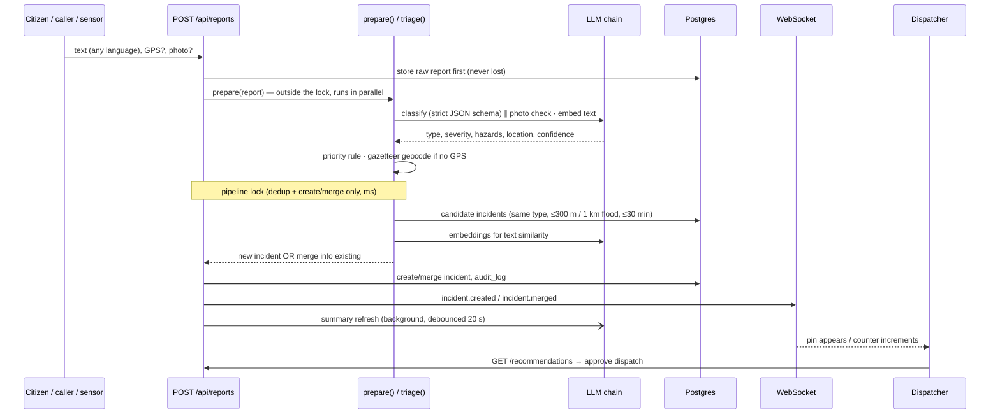
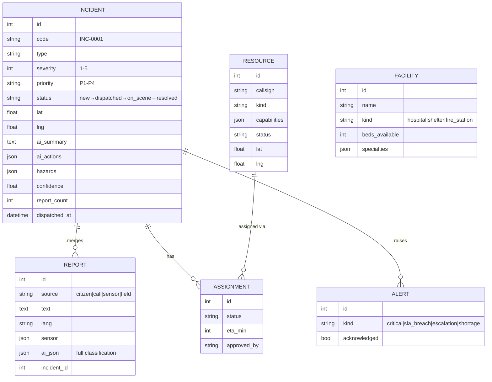

# ResQNet — Architecture

> Intelligent emergency response & resource coordination for Ahmedabad (PS-9, Bit N Build '26).
> Contract details: [API_CONTRACT.md](API_CONTRACT.md) · Product: [PRD.md](PRD.md) · Ownership: [TEAM_WORKFLOW.md](TEAM_WORKFLOW.md)

## 1. System at a glance

```mermaid
flowchart LR
    subgraph Inputs
        C[Citizen app<br/>/report · EN/GU/HI · photo]
        K[108/112 call<br/>transcripts]
        S[IoT sensors<br/>water level · gas · rain]
        F[Field crews<br/>/field updates]
    end

    subgraph Backend["FastAPI backend (Render)"]
        R[POST /api/reports]
        T[triage&#40;&#41;<br/>classify · geocode · dedup]
        I[(Postgres · Neon<br/>incidents · reports · resources<br/>assignments · alerts · audit_log)]
        REC[Recommender]
        SUM[Summarizer · SITREP]
        TR[Trust &amp; conflicts]
        INS[Insights · Analytics]
        ESC[Escalation loop<br/>SLA · shortages]
        WS[WebSocket hub]
        N[Telegram notifier]
    end

    subgraph AI["AI providers"]
        O[OpenAI gpt-4.1-mini]
        G[Gemini flash-lite<br/>+ embeddings]
        RU[Keyword rules<br/>always available]
    end

    subgraph Frontend["Next.js (Vercel)"]
        D[Command center<br/>/dashboard · map]
        A[/analytics · /resources/]
        FV[/field/]
    end

    C & K & S & F --> R --> T --> I
    T -.-> O & G & RU
    I --> REC & SUM & TR & INS
    SUM -.-> O
    ESC --> I
    ESC --> N
    I --> WS --> D & FV
    D -- approve dispatch --> I
    REC & TR & INS --> D & A
```



**Design principles**
1. **AI recommends, humans decide.** The AI classifies, merges and ranks. Dispatch and escalation are always a human click, and every action is written to `audit_log`.
2. **Never drop a report.** Every AI step has a deterministic fallback, so an outage degrades quality, not availability.
3. **Explainable.** Every AI output carries `reasoning`, `confidence`, the model that answered, and the evidence behind it.
4. **Contract-first.** Frontend and backend develop in parallel against `API_CONTRACT.md`, and the frontend has a mock mode.

## 2. Tech stack

| Layer | Choice | Why |
|---|---|---|
| API | Python 3.11, FastAPI, Pydantic v2 | typed contract, async WebSockets, fast to build |
| DB | SQLAlchemy 2.0 · SQLite (dev) / Postgres on Neon (prod) | zero-setup locally, managed in prod |
| Realtime | FastAPI WebSocket, `ws_manager.manager.publish(event, data)` (thread-safe, ordered per client) | live map without polling |
| AI | OpenAI `gpt-4.1-mini` → Gemini `3.5-flash-lite` → keyword rules | quality first, then cost/quota fallbacks |
| Embeddings | Gemini `gemini-embedding-001` → OpenAI `text-embedding-3-small` | Gemini separates EN↔GU↔HI duplicates far better |
| Frontend | Next.js 16, Tailwind, MapLibre (OSM tiles), Recharts | free maps, fast charts |
| Notifications | Telegram Bot API | a phone buzzes on stage |
| Hosting | Render (API) · Vercel (web) · Neon (DB) | free tiers, git-push deploys |

## 3. Report lifecycle



Typical latency: about 1.4 s of AI time per report (measured), about 2 ms when cached. The raw report is saved before any AI call.
**Concurrency:** AI classification runs *outside* the pipeline lock, and only dedup + create/merge are serialised (so simultaneous duplicates can't race into two incidents). Measured on a real server with OpenAI: 8 simultaneous reports all answered in 3.2–5.6 s (vs 16.4 s when classification was inside the lock), still merged correctly.

## 4. AI & intelligence layer (BE2)

All AI code is in `backend/app/services/`. Every public function **never raises**.

| Module | Responsibility | Fallback |
|---|---|---|
| `llm.py` | Provider chain, strict JSON-schema output, per-model RPM pacing, 429/404/5xx handling, retries, memory + SQLite disk cache, OpenAI spend cap ($8) | next model → next provider → `None` |
| `classifier.py` | Type, severity 1–5, hazards, location, people affected, language, reasoning, confidence. EN/GU/HI few-shot | EN/GU/HI keyword rules with negation ("nobody hurt") |
| `classifier.priority_for` | **Deterministic** P1–P4: P1 if severity ≥ 4 or trapped people / gas leak / spreading fire | the rule *is* the fallback |
| `classifier.classify_sensor` | Reading vs threshold → severity. Rain gauges cap at S3 (they corroborate, they don't escalate) | rules only, by design |
| `vision.py` | Photo → severity hint (max +1). SSRF-guarded URL fetch | ignored |
| `gazetteer.py` | ~35 Ahmedabad places with EN/GU/HI aliases → lat/lng when no GPS | city centre + "location unverified" (confidence ≤ 0.4) |
| `dedup.py` | Type + distance (300 m, 1 km floods) + 30 min window + embedding cosine with per-model thresholds | geo + time only |
| `triage.py` | `prepare()` = classify + geocode + embed (no DB, parallel) · `triage(prepared=)` = dedup under BE1's lock. Honours `incident_id` hints from field crews | — |
| `recommender.py` | Score = 0.5·capability fit + 0.35·ETA + 0.15·load balance. Matches unit capabilities (aerial ladder, swift-water, cardiac…) and hospital specialties. AI writes one-line reasons | template reasons |
| `summarizer.py` | English incident summary + actions, and a city-wide SITREP (markdown) | template summary |
| `trust.py` | Verification level, distinct sources, sensor corroboration, **conflicts** between reports (people count, severity, type, "contained" vs "worsening") | pure rules |
| `insights.py` | SLA breaches, resource shortages, coverage gaps, report surges, conflicts | pure rules |

### Resilience ladder
```
OpenAI gpt-4.1-mini ─► gpt-4.1-nano ─► Gemini 3.5-flash-lite ─► 3.1-flash-lite ─► 3.6-flash ─► keyword rules
        (rate limit → bench model for retry-after · quota/404 → bench 1 h · 5xx → retry once, cool provider)
```
- **Cache:** identical text + source is never sent to a model twice (disk cache survives restarts). The demo scenario is pre-warmed, so it runs instantly even offline.
- **Budget:** OpenAI spend is tracked per call and hard-capped at $8. Measured cost is about $0.03 per 50 reports.
- **Status:** `GET /api/ai/status` shows the active models, benched models, spend and cache state.

### Measured quality (`scripts/eval.py`, 50 labelled EN/GU/HI reports, 27 real incidents)

| Metric | Result |
|---|---|
| Incident type accuracy | **100 %** |
| Severity within ±1 | **100 %** (exact 80 %) |
| P1 recall | **96.8 %** |
| Duplicate detection precision / recall | **1.00 / 1.00** (27 → 27 incidents) |
| Language detection | 100 % |
| Avg AI latency | 1.4 s / report |
| Cost | $0.027 per 50 reports |

End-to-end check: `scripts/dry_run.py` runs the full pipeline on the demo scenario. 30 reports → 11 incidents, each story is exactly one incident, and no false merges.

## 5. Data model


Plus `audit_log` (actor, action, entity, payload) for every create, merge, dispatch and status change.

Seed data covers real Ahmedabad locations: 25 units (10 × 108 ambulances, 4 fire trucks, 4 NDRF boats, 2 NDRF teams, 4 police PCRs, 1 hazmat) and 18 facilities (10 hospitals, 4 relief shelters, 4 fire stations).

## 6. Realtime & alerts
- **WebSocket** `/ws` events: `incident.created`, `incident.merged`, `incident.updated`, `assignment.updated`, `alert.created`, `resource.updated`.
- **Escalation loop** (every `ESCALATION_TICK_SEC`): P1 undispatched > 120 s / P2 > 300 s → `sla_breach` → `escalation`. It also raises shortage alerts and never duplicates an alert for the same incident and kind.
- **Telegram:** critical and escalation alerts go to the authority chat, dispatches go to the responder chat, each with a Google Maps link.

## 7. Deployment & security

```
Vercel (Next.js)  ──HTTPS/WSS──►  Render (FastAPI, uvicorn)  ──TLS──►  Neon Postgres
                                        │
                                        └──► OpenAI · Gemini · Telegram (server-side only)
```
- API keys exist **only** in `backend/.env` (gitignored) and Render environment variables. They are never in the frontend or in git. Diffs are scanned for keys before every commit.
- CORS is restricted to the frontend origin. Photo URLs are fetched with an SSRF guard (public hosts only, no redirects).
- `POST /api/simulator/reset` reseeds atomically: seed files are validated before anything is deleted.

## 8. Team ownership

| Area | Owner | Paths |
|---|---|---|
| BE1 — core & realtime | Rahi | `models.py`, `schemas.py`, `db.py`, `main.py`, `pipeline.py`, `audit.py`, `routers/{reports,incidents,dispatch,resources,alerts,simulator,ws}.py`, `services/{geo,escalation,notifier}.py`, seed + scenario |
| BE2 — AI & intelligence | Dev | `services/{llm,classifier,dedup,recommender,summarizer,vision,gazetteer,triage,trust,insights}.py`, `routers/{ai,analytics}.py`, `scripts/{eval,warm_cache,dry_run}.py` |
| FE1 — command center | Maansi | `/dashboard`, map, incident drawer, dispatch |
| FE2 — reporting & insights | Diya | `/report`, `/field`, `/analytics`, `/resources`, landing, API layer, types |

## 9. Runbook

```bash
cd backend && pip install -r requirements.txt && python -m scripts.seed && uvicorn app.main:app --reload
python -m scripts.eval                 # accuracy numbers (add --no-ai for rules only)
python -m scripts.dry_run --no-ai      # full AI pipeline on the demo scenario, offline
python scripts/warm_cache.py           # pre-load AI results for the demo
cd frontend && npm ci && npm run dev
```
